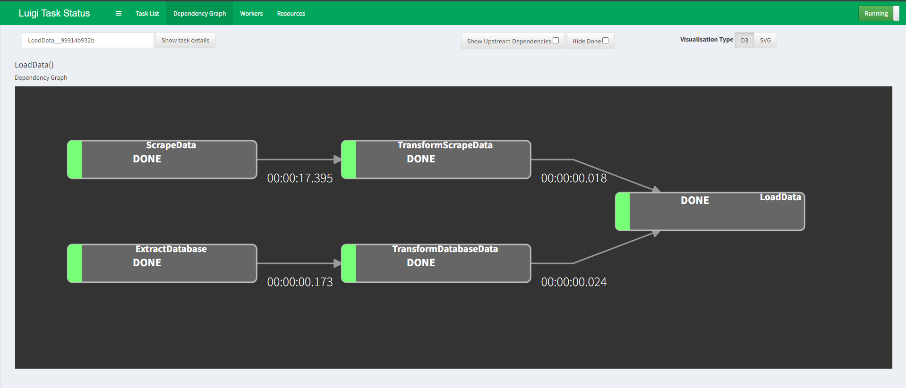

# Complex ETL Pipeline Luigi

## Problem
---

- Tim Data Scientist membutuhkan data text untuk membuat model NLP
- Tim Data Analyst juga membutuhkan data marketing untuk melakukan analisis
- Tetapi data yang dibutuhkan tidak tersedia

## Solution
---

- Membuat ETL Pipeline untuk “Generate” data berasal dari source:
    - Data Text: https://quotes.toscrape.com/ 
    - Data Marketing: DB PostgreSQL
- Melakukan proses Transformasi data
- Simpan data yang sudah diproses ke dalam satu database yang sama

## Breakdown Problem
---

**Data Text**

- Data yang ingin kita ambil berada di website
- Maka yang harus kita lakukan adalah melakukan scraping data
- Kita akan menggunakan repository https://github.com/shandytepe/quotes_scraper untuk melakukan scraping data
- Pada proses Transform, kita akan menghilangkan squared bracket `[]` pada kolom `tags`
- Setelah itu, kita akan simpan ke dalam Database `data_wrangling` pada table `scrape_table`

**Data Marketing**

- Data Marketing yang ingin kita ambil, terdapat ada di database `data_wrangling` table `dev_mall_customers`
- Oleh karena itu, pada saat kita ingin Extract data kita harus membuat koneksinya terlebih dahulu
- Pada proses Transform, kita akan mengganti value pada kolom `gender` menjadi
    - `Male`: `male`
    - `Female`: `male`
- Setelah itu, kita akan simpan ke dalam Database `data_wrangling` pada table `db_mall_customers`

## ETL Pipeline Result

